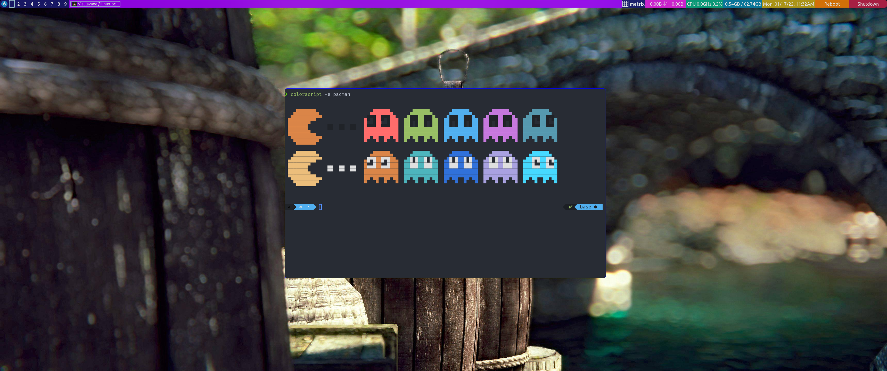

# My Custom Arch-Linux Build

This repo stores all the configuration files for my custom operating system which uses the qtile tiling window manager.

# Packages
For complete migration steps refer to: https://wiki.archlinux.org/title/migrate_installation_to_new_hardware
```
# Install packages
pacman -S --needed - < pkglist.txt
yay -S --needed - < pkglist_aur.txt
```

# Pictures 



